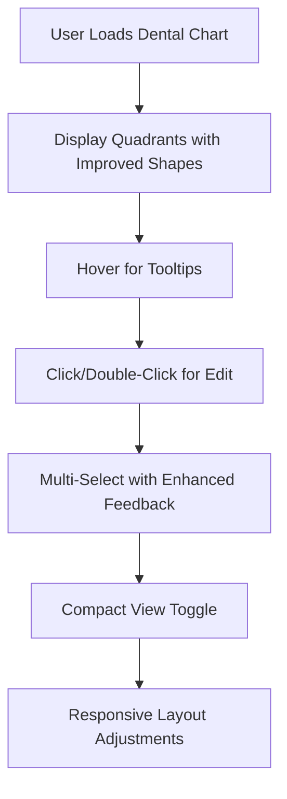

# Dental Chart UI/UX Improvements Design Specifications

## Overview

Based on analysis of `components/DentalChart.tsx`, the following improvements are proposed to enhance user experience, focusing on shape, display methods, and visual enhancements. The 3D chart view is removed as requested. All suggestions are practical for implementation in React with Tailwind CSS and do not affect the database.

## 1. Removal of 3D Chart View

**Rationale**: The 3D view adds complexity and may confuse users. Removing it simplifies the interface and improves performance.

**Specifications**:
- Remove the "View 3D" / "Exit 3D View" toggle button from the controls bar.
- Eliminate the `is3DView` state variable and all related logic.
- Remove `is3DView` prop from `ToothComponent`.
- In `ToothComponent`, always display the tooth number (`{number}`) and status label below.
- Remove the conditional rendering of icons and the `transform rotate-12` class from the button.
- Update button className to remove the conditional transform.

**Impact**: Simplifies code by ~20 lines, improves load time, enhances clarity.

## 2. Tooth Shape and Layout Improvements

**Rationale**: Current rectangular buttons don't resemble teeth. Improved shapes and layout enhance visual appeal and usability.

**Shape Enhancements**:
- Change tooth button shape to a more anatomically realistic tooth form using CSS `clip-path` for a crown shape.
- Example: Use `clip-path: polygon(15% 0%, 85% 0%, 95% 15%, 100% 30%, 100% 100%, 0% 100%, 0% 30%, 5% 15%)` to create a tapered crown with roots implied by the flat bottom.
- For even more realism, consider overlaying a subtle SVG icon of a tooth silhouette as background image, scaled to fit.
- Adjust size to `w-10 h-12` for better proportion and visibility.
- Maintain accessibility with sufficient touch targets (minimum 44px).

**Layout Improvements**:
- Enhance responsive design: On screens < md, stack quadrants vertically with `flex-col`.
- Add a "Compact View" toggle button in controls.
- In compact view, display all 32 teeth in a single 4x8 grid using CSS Grid, with quadrants labeled above rows.
- Improve spacing between teeth to `gap-2` for better touch targets.

**UX Benefits**: More intuitive representation, better mobile experience, flexible viewing options.

## 3. Enhanced Display Methods and Interactions

**Rationale**: Current interactions are basic. Enhancements provide richer feedback and accessibility.

**New Features**:
- **Hover Tooltips**: On desktop, show a tooltip on tooth hover displaying status, notes (truncated), and last treatment date if available. Use a library like `react-tooltip` or custom div with absolute positioning.
- **Double-Click Edit**: Double-click a tooth to open the edit modal directly.
- **Keyboard Navigation**: Add `tabIndex` to tooth buttons. Use arrow keys to navigate between adjacent teeth, Enter to edit, Escape to close modals.
- **Selection Feedback**: For multi-select, add a subtle pulse animation (`animate-pulse`) to selected teeth.
- **Long Press Alternative**: On mobile, use touch events for long press to show history (current right-click).
- **Export Chart**: Add an "Export Chart" button in the controls to download the current chart as a PDF or PNG image. Use libraries like `html2canvas` for screenshot and `jsPDF` for PDF generation. Include patient name, date, and clinic info in the export.

**Display Methods**:
- Add a "Show Notes" toggle to display/hide notes labels below teeth for cleaner view.
- Implement a zoom slider instead of +/- buttons for finer control (use HTML input range).

**UX Benefits**: Improved accessibility (WCAG AA compliance), faster interactions, better information density.

## 4. Visual Enhancements and Styling Improvements

**Rationale**: Current styling is functional but dated. Modern visuals improve engagement and professionalism.

**Color and Theming**:
- Update `toothStatusColors` to use gradients: e.g., `bg-gradient-to-b from-blue-400 to-blue-600` for filling.
- Ensure high contrast ratios (e.g., white text on dark backgrounds).
- Add support for dark mode if the app has it, using Tailwind's `dark:` prefixes.

**Animations and Effects**:
- Add `transition-all duration-200 ease-in-out` to tooth buttons for smooth state changes.
- On hover: `scale-105 shadow-lg transform-gpu` (use GPU acceleration for performance).
- On click/active: `scale-95` with a quick `duration-100`.
- For multi-select: Add `animate-bounce` briefly when selecting, then settle to `ring-2 ring-blue-400 animate-pulse` for ongoing selection.
- Fade-in animation for modals: Use `opacity-0 animate-fadeIn` with keyframes: `from { opacity: 0; transform: scale(0.95); } to { opacity: 1; transform: scale(1); }`.
- Zoom transitions: Smooth scale change with `transition-transform duration-300`.
- Status change animations: Brief color flash (e.g., `bg-green-200 animate-ping` then settle to new color) when updating tooth status.

**Typography and Spacing**:
- Use consistent font sizes: tooth numbers `text-sm font-semibold`, labels `text-xs`.
- Improve modal padding and spacing for better readability.
- Add subtle borders and shadows to quadrants (`bg-slate-50 border border-slate-200 rounded-lg shadow-sm`).

**Legend Redesign**:
- Move status legend to a collapsible sidebar or bottom panel.
- Use icons next to colors for better recognition (e.g., small tooth icon with color).

**Accessibility Enhancements**:
- Improve ARIA labels: `aria-label="Tooth {toothId}: {status}, {notes}"`.
- Add `role="button"` and `tabIndex="0"` to tooth elements.
- Ensure focus rings are visible (`focus:ring-2 focus:ring-blue-500`).

**UX Benefits**: More engaging interface, better readability, inclusive design.

## Implementation Considerations

- **Code Structure**: Refactor `ToothComponent` to remove 3D logic. Add new props for tooltips and compact view.
- **Performance**:
  - Use `React.memo` for `ToothComponent` to prevent unnecessary re-renders.
  - Apply `transform-gpu` (e.g., `translateZ(0)`) to animating elements to leverage GPU acceleration.
  - Limit animations to essential interactions; avoid animating large lists simultaneously.
  - Use `will-change` CSS property sparingly on animated elements (e.g., `will-change: transform`) and remove it after animation completes.
  - Test animation performance on low-end devices; consider reducing complexity for mobile.
- **Testing**: Test on Chrome, Firefox, Safari; mobile devices; screen readers.
- **Backward Compatibility**: Ensure existing `chartData` and `onUpdate` props work unchanged.
- **No Database Impact**: All changes are client-side UI enhancements.

## Mermaid Diagram for Workflow

This design plan provides a comprehensive upgrade to the dental chart, prioritizing user experience and modern design principles.