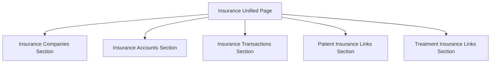
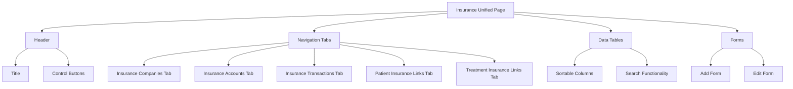

# تصميم صفحة موحدة للتأمين

## المتطلبات
- إنشاء صفحة جديدة تجمع بين جميع عناصر التأمين في صفحة واحدة.
- دمج جميع وظائف التأمين الحالية في واجهة مستخدم موحدة.
- التأكد من أن القائمة الجانبية تتناسب مع هذا التصميم الجديد.

## التحليل الحالي

### 1. صفحات التأمين الحالية
- **PatientInsuranceLinkPage**: تعرض روابط المرضى بشركات التأمين.
- **TreatmentInsuranceLinkPage**: تعرض روابط جلسات العلاج بشركات التأمين.
- **InsuranceCompaniesPage**: تعرض قائمة بشركات التأمين.
- **InsuranceAccountsPage**: تعرض حسابات شركات التأمين.
- **InsuranceTransactionsPage**: تعرض المعاملات مع شركات التأمين.

### 2. قاعدة البيانات الحالية
- **insurance_companies**: تحتوي على معلومات شركات التأمين.
- **insurance_accounts**: تحتوي على حسابات شركات التأمين.
- **insurance_transactions**: تحتوي على المعاملات مع شركات التأمين.
- **patient_insurance_link**: تحتوي على روابط المرضى بشركات التأمين.
- **treatment_insurance_link**: تحتوي على روابط جلسات العلاج بشركات التأمين.

### 3. القائمة الجانبية الحالية
- تحتوي على عناصر منفصلة لكل صفحة من صفحات التأمين.
- تحتاج إلى تحديث لتضمين رابط إلى الصفحة الموحدة الجديدة.

## تصميم الصفحة الموحدة

### 1. هيكل الصفحة

### 2. مكونات الصفحة
- **رأس الصفحة**: عنوان الصفحة وأزرار التحكم.
- **تبويبات التنقل**: تبويبات للتنقل بين أقسام التأمين المختلفة.
- **جداول البيانات**: عرض البيانات في جداول قابلة للفرز والبحث.
- **نماذج الإضافة والتعديل**: نماذج لإضافة وتعديل البيانات.

### 3. تبويبات التنقل
- **شركات التأمين**: عرض وإدارة شركات التأمين.
- **حسابات التأمين**: عرض وإدارة حسابات التأمين.
- **معاملات التأمين**: عرض وإدارة معاملات التأمين.
- **روابط المرضى**: عرض وإدارة روابط المرضى بشركات التأمين.
- **روابط العلاج**: عرض وإدارة روابط جلسات العلاج بشركات التأمين.

### 4. تصميم الواجهة

## تنفيذ التصميم

### 1. إنشاء الصفحة الموحدة
- إنشاء ملف جديد [`InsuranceUnifiedPage.tsx`](components/finance/InsuranceUnifiedPage.tsx).
- دمج جميع وظائف صفحات التأمين الحالية في صفحة واحدة.
- استخدام تبويبات للتنقل بين أقسام التأمين المختلفة.

### 2. تحديث القائمة الجانبية
- إضافة رابط جديد إلى الصفحة الموحدة في القائمة الجانبية.
- التأكد من أن الرابط يظهر في القسم المناسب (القسم المالي).

### 3. اختبار التصميم
- اختبار عرض البيانات في جميع الأقسام.
- اختبار إضافة وتعديل وحذف البيانات.
- اختبار التنقل بين التبويبات.
- اختبار التوافق مع القائمة الجانبية.

## الخطوات التالية
1. إنشاء الصفحة الموحدة.
2. تحديث القائمة الجانبية.
3. اختبار التصميم.
4. التأكد من التوافق مع النظام الحالي.